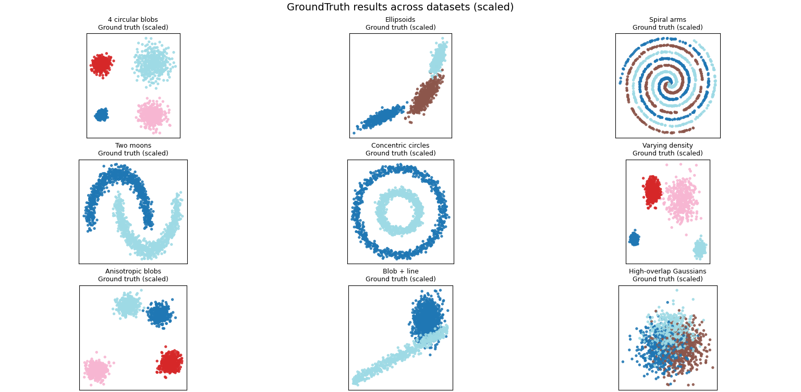

# Anomaly Detection

This repository focuses on anomaly detection workflows and experimentation.

As a first step, the emphasis is on understanding and exploring the data.  
Before building anomaly detection models, it is important to establish a solid baseline for how different clustering algorithms behave across various data structures.

The initial objectives of this project are:

• Explore synthetic and real datasets  
• Compare clustering algorithm performance  
• Build intuition around algorithm strengths and failure modes  
• Establish baseline metrics for evaluation

The clustering benchmark includes methods such as:

• K-Means  
• Gaussian Mixture Models (GMM)  
• DBSCAN  
• HDBSCAN  
• Agglomerative Clustering  
• Spectral Clustering  
• Mean Shift

Example benchmarking output:

  

---

## Project Goals

This repository will progressively expand toward:

• Robust anomaly detection pipelines  
• Feature engineering strategies  
• Density and distance-based detection methods  
• Scalable implementations  
• Model evaluation and diagnostics

---

## Notes

Clustering is used here primarily as an exploratory and diagnostic tool rather than a final modeling solution.

Understanding cluster structure, separability, and algorithm behavior provides critical insight for downstream anomaly detection tasks.